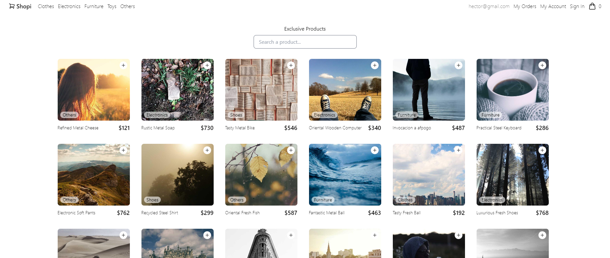

# Shopi - E Commerce

Desarrollo de E Commerce. Challenge personal sin fines de lucro.

<kbd>

</kbd>

## Enlaces de interés 🔗

- [Curso](https://platzi.com/cursos/react-vite-tailwindcss/)

## Deploy 🚀

- [Ver página web](https://helpful-capybara-8253b6.netlify.app/)

## Construido con 🛠️

Las herramientas utilizadas para crear el proyecto.

- [React](https://es.react.dev/)
- [Vite](https://vitejs.dev/)
- [Tailwind](https://tailwindcss.com/)

## Contribuir 🖇️

Eres libre de contribuir a este proyecto por medio de Pull Request.

## Autores ✒️

- **Héctor Reyes** - _Desarrollo_ - [HéctorDevx](https://github.com/hector-reyes-dev)

## Licencia 📄

Este proyecto está bajo la Licencia MIT. Todos las marcas son propiedad de sus dueños.

## Gracias 🎁

- Comenta a otros sobre este proyecto 📢
- Invitame una taquito 🌮 o no olvides dejar una estrella ⭐.
- Taquito: [Taco](https://www.paypal.me/HReyes117)

---

Creado con 💚 por [HéctorDevx](https://github.com/hector-reyes-dev) 😊
